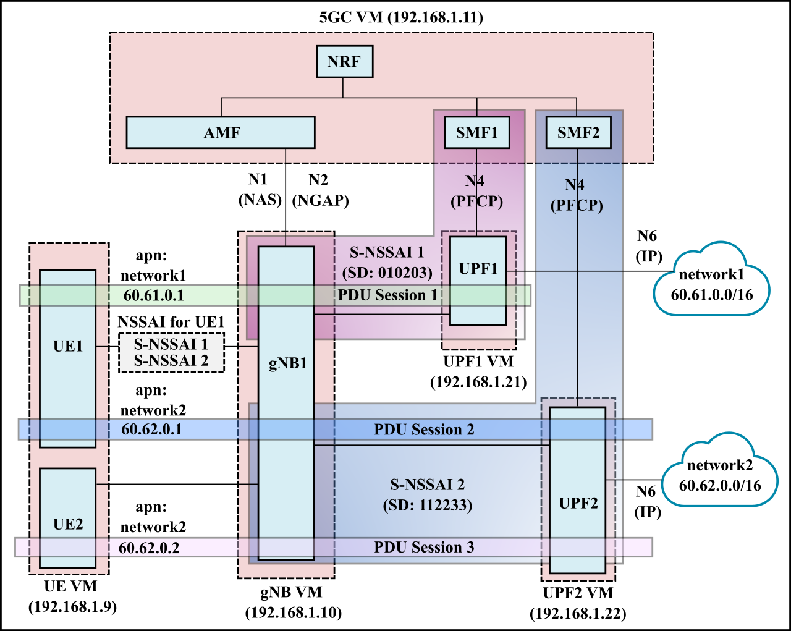
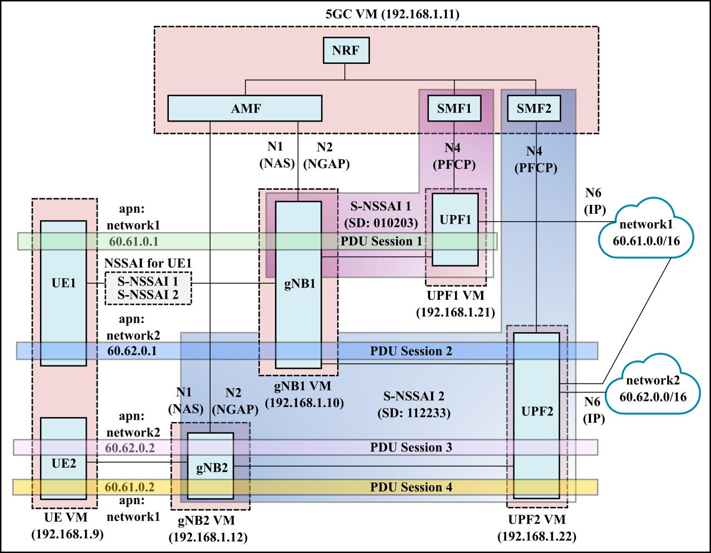

# 5gc-config
This repo contains configuration files for the deployment of 5G core, using
the [free5gc](https://github.com/free5gc/free5gc) project and UE and gNB
simulation using the [UERANSIM](https://github.com/aligungr/UERANSIM) project.

The configuration files and scripts for the various deployment scenarios shown below can be found in the corresponding sub-directories.

Information on packet captures can be found in [packet_capture.md](packet_capture.md).

General debugging information (common to all deployment scenarios) can be found in [debugging.md](debugging.md). Debugging information only applicable to particular deployments can be found in the corresponding README.

- [5gc-config](#5gc-config)
  - [Single UPF](#single-upf)
  - [Multiple UPFs](#multiple-upfs)
  - [Network Slicing 01: 2 Slices](#network-slicing-01-2-slices)
  - [Network Slicing 02: UE connects to multiple slices](#network-slicing-02-ue-connects-to-multiple-slices)
  - [Network Slicing 03: Multiple gNBs](#network-slicing-03-multiple-gnbs)

## Single UPF
- This is the simplest scenario, with 1 S-NSSAI, 1 UE, and 1 UPF. 
- The UE establishes a single PDU session with the UPF.

## Multiple UPFs
- In this scenario, we have 1 S-NSSAI, 2 UEs and 2 UPFs. 
- Each UE establishes a separate PDU session with an UPF.

## Network Slicing 01: 2 Slices

- In this scenario, we have 2 S-NSSAI representing two network slices (each consisting of 1 SMF and 1 UPF). 
- UE1 and UE2 each connect to separate slices with 1 PDU session each.

## Network Slicing 02: UE connects to multiple slices

- In this scenario, we have 2 S-NSSAI representing two network slices (each consisting of 1 SMF and 1 UPF). 
- UE1 connects to both slice 1 and slice 2 using two separate PDU sessions.
- UE2 has a single PDU session with slice 2.

## Network Slicing 03: Multiple gNBs

- This is an extension of the [slicing 02](#network-slicing-02-ue-connects-to-multiple-slices) scenario shown above.
- Here, we have two gNodeBs, gNB1 and gNB2. gNB1 supports both slices (i.e., S-NSSAI1 and S-NSSAI2), while gNB2 only supports a single slice (S-NSSAI1).
- UPF2 connects to both DNNs, i.e., network1 and network2.

