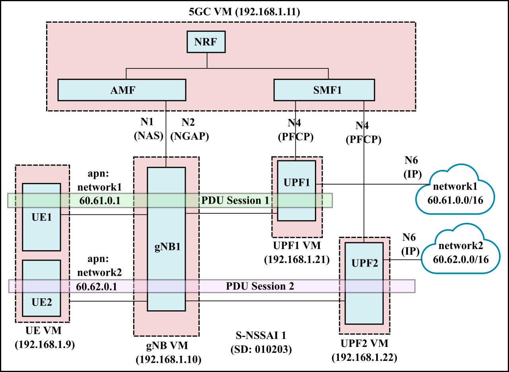
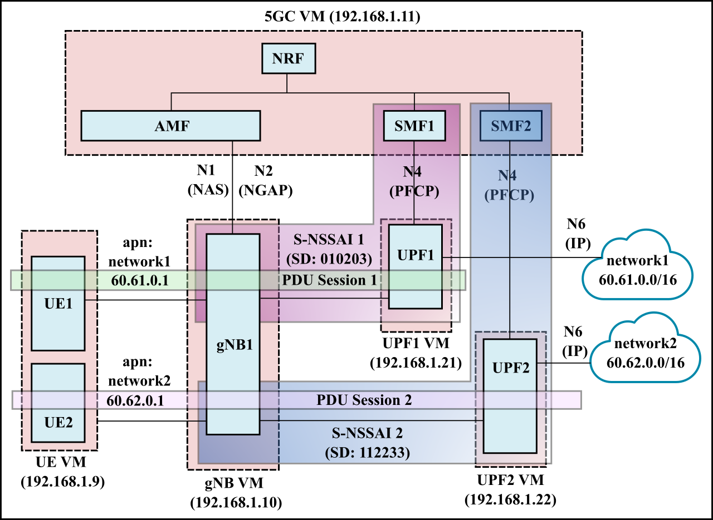

# 5gc-config
This repo contains configuration files for the deployment of 5G core, using
the [free5gc](https://github.com/free5gc/free5gc) project and UE and gNB
simulation using the [UERANSIM](https://github.com/aligungr/UERANSIM) project.

## Single UPF
- This is the simplest scenario, with 1 S-NSSAI, 1 UE, and 1 UPF. 
- The UE establishes a single PDU session with the UPF.

The configuration files and scripts are in the [single_upf](single_upf) directory.

## Multiple UPFs
- In this scenario, we have 1 S-NSSAI, 2 UEs and 2 UPFs. 
- Each UE establishes a separate PDU session with an UPF.

The configuration files and scripts are in the [multi_upf](multi_upf) directory.

## Network Slicing 01

- In this scenario, we have 2 S-NSSAI representing two network slices (each consisting of 1 SMF and 1 UPF). 
- UE1 and UE2 each connect to separate slices with 1 PDU session each.

The configuration files and scripts are in the [slicing_01](slicing_01) directory.

## Network Slicing 02 (TODO)

- In this scenario, we have 2 S-NSSAI representing two network slices (each consisting of 1 SMF and 1 UPF). 
- UE1 connects to both slice 1 and slice 2 using two separate PDU sessions.
- UE2 has two PDU sessions with the same slice (slice 2).

The configuration files and scripts are in the [slicing_02](slicing_02) directory.

## Network Slicing 03 (TODO)

- This is an extension of the [network slicing 02](#network-slicing-02-todo) scenario shown above.
- Here, we have two gNodeBs, gNB1 and gNB2. gNB1 supports both slices (i.e., S-NSSAI1 and S-NSSAI2), while gNB2 only supports a single slice (S-NSSAI1).
- UPF2 connects to both DNNs, i.e., network1 and network2.

