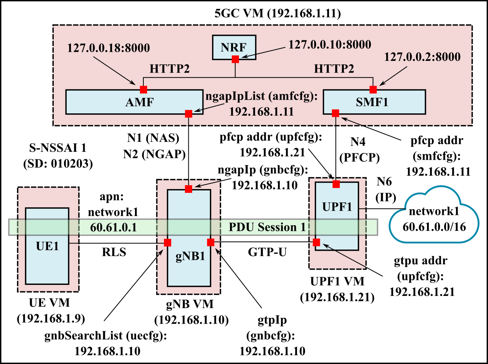

# 5gc-config
This repo contains configuration files for the deployment of 5G core, using
the [free5gc](https://github.com/free5gc/free5gc) project and UE and gNB
simulation using the [UERANSIM](https://github.com/aligungr/UERANSIM) project.

## Single UPF
The deployment scenario is shown below. A single UPF is used.
The configuration files are in the `single_upf` folder.  

## Branch UPF
The deployment scenario is shown below.
