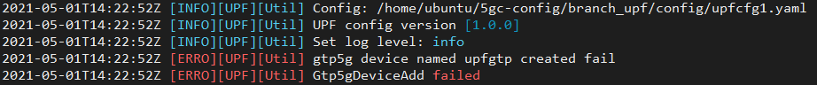
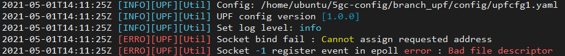

# Debugging and FAQs

- [No messages are exchanged between 5GC, UPF, and gNB](#no-messages-are-exchanged-between-5gc-upf-and-gnb)
- [UPF gtp5g device add failed](#upf-gtp5g-device-add-failed)
- [UPF socket bind failed](#upf-socket-bind-failed)
- [Cannot access Internet from the UE TUN interface](#cannot-access-internet-from-the-ue-tun-interface)
- [OpenStack instances cannot access Internet](#openstack-instances-cannot-access-internet)
- [Using Mongodb database](#using-mongodb-database)

## No messages are exchanged between 5GC, UPF, and gNB
The following messages should be exchanged  
- PFCF messages between 5GC and UPF
- SCTP messages between gNB and 5GC

**Fix**:
If these are not working, check if the proper security rules are present in the VMs!

## UPF gtp5g device add failed



This can occur if the `upfgtp` interface already exists, and has not been cleaned up from a previous iteration.
Check using `ifconfig`.

**Fix**
Remove the existing `upfgtp` interface as follows:
```
$ sudo ip l del upfgtp
```

## UPF socket bind failed



This can occur if the wrong IP address has been specified in the `upfcfg.yaml` file.

**Fix**:
Correct the IP address in the `upfcfg.yaml` file. It should be the IP address of the VM this UPF is running on.


## Cannot access Internet from the UE TUN interface

**Connection diagram**:
```
| ueramsim vm (192.168.1.10) -- uesimtun0 interface | ======= GTP-U tunnel ====== | upfgtp interface -- upf VM (192.168.1.228) -- NAT to Internet |
```

**Debugging**:

1. Capture packet traces at the primary interface (ens7) at the UPF VM. Ping packets seem to reach it just fine, inside the GTP-U tunnel.

2. From the UPF VM the traffic needs to pass through a NAT to reach the Internet. *This is the problem.*

3. The NAT rule was set up for the primary interface which was called ens3 (this was for UPF1 which was stuck at rebooting). For the UPF that was created now (UPF2), the interface is called ens7.


**Fix**:  
Change the NAT masquerade rule to

`$ sudo iptables -t nat -A POSTROUTING -o ens7 -j MASQUERADE`


**Fix for the OSM deployment**  
The UPF VM seems to have 2 interfaces - a) one is ens3 which is the provider which has internet access, and b) ens4 corresponding to the osm network which does not have internet access.
So in the UPF, the IP masquerade has to be set for ens3 in order to have internet access.


## OpenStack instances cannot access Internet
- Check is DNS is working properly.
- If yes, delete and re-create the router providing the floating IP addresses.
- Release floating IPs and assign new.


## Using Mongodb database
Run the mongodb CLI and switch to free5gc database using `use free5gc`.  
See a list of all collections using `show collections` .

Information can be extracted from mongodb in JSON format as follows:
```
mongo free5gc --eval "printjson(db.NfProfile.findOne({nfType: 'SMF'}))" > smf_nfprofile.json
```
