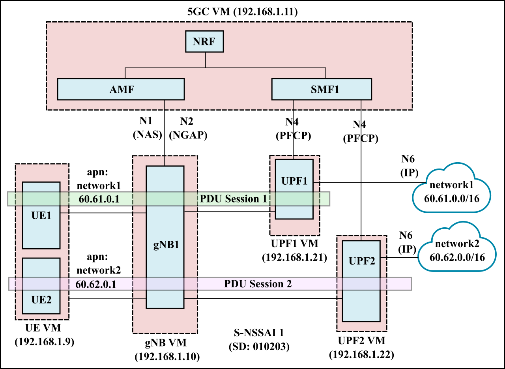
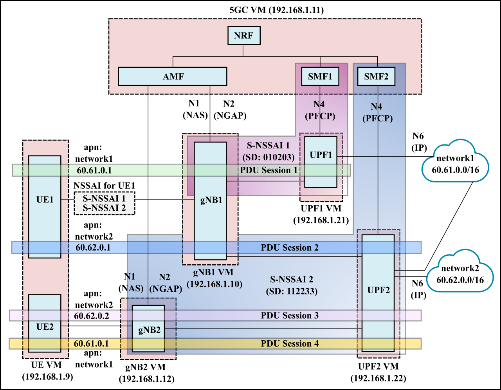

# Basic Slicing Deployments

## Deployment Scenarios
The following deployment scenarios have been tested:
- Single network slice with a single PDU session (1 UPF). This is the simplest scenario, with 1 S-NSSAI, 1 UE, and 1 UPF. The UE establishes a single PDU session with the UPF.

  

- Single network slice with two PDU sessions (2 UPFs). In this scenario, we have 1 S-NSSAI, 2 UEs and 2 UPFs. Each UE establishes a separate PDU session with an UPF.

  

- Two network slices with an UE connnected to each slice. In this scenario, we have 2 S-NSSAI representing two network slices (each consisting of 1 SMF and 1 UPF). UE1 and UE2 each connect to separate slices with 1 PDU session each.

  

- Two network slices with UE connected to both slices. In this scenario, we have 2 S-NSSAI representing two network slices (each consisting of 1 SMF and 1 UPF). UE1 connects to both slice 1 and slice 2 using two separate PDU sessions.UE2 has a single PDU session with slice 2.
  
  

- Two network slices with two gNodeBs. This is an extension of the previous scenario. Here, we have two gNodeBs, gNB1 and gNB2. gNB1 supports both slices (i.e., S-NSSAI1 and S-NSSAI2), while gNB2 only supports a single slice (S-NSSAI1). UPF2 connects to both DNNs, i.e., network1 and network2.

  

## Debugging
General debugging information can be found [here](DEBUGGING.md).
Issues specific to a particular deployement scenario are discussed in the corresponding `README` file.

