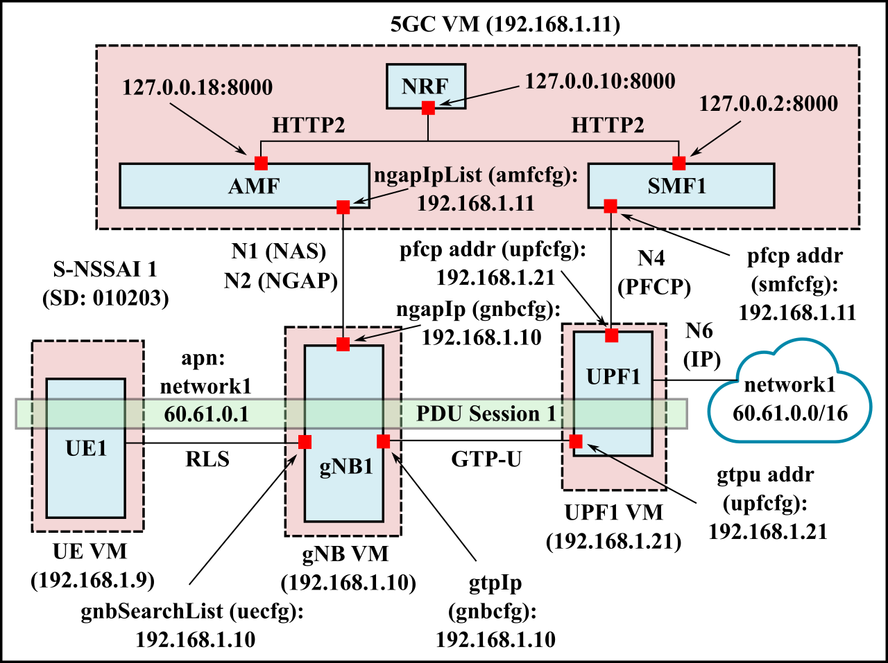

# Single network slice with a single PDU session (1 UPF)

This is the simplest scenario, with 1 S-NSSAI, 1 UE, and 1 UPF. The UE establishes a single PDU session with the UPF. 



**Table of Contents**
- [Setting up the VMs](#setting-up-the-vms)
- [Configuration](#configuration)
- [Running the NFs](#running-the-nfs)

## Setting up the VMs
For this deployment, we have 4 VMs, all running Ubuntu 20.04 LTS. As evident from the figure, we have:
- 1 VM for the UE (192.168.1.9)
- 1 VM for the gNB (192.168.1.10)
- 1 VM for the 5G core functions except UPF (192.168.1.11)
- 1 VM for the UPF (192.168.21)

**Note**: The 5GC and UPF VMs have `free5gc` installed on them, while the UE and gNB VMs have `UERANSIM` installed. See [free5gc installation](https://github.com/free5gc/free5gc/wiki/Installation) and [UERANSIM installation](https://github.com/aligungr/UERANSIM/wiki/Installation).

**Important**: Note that we used free5gc `v3.0.5` and UERANSIM `v3.1.7`. The configuration files vary across versions, so make sure to use this versions if using the configuration files in this repository.

For deploying the VMs, we leveraged OpenStack. However, they can be managed by something like VirtualBox as well. 

All the VMs are on a private network called `5gc-net` and are reachable from one another. For this lab deployment all TCP and UDP ports are open. However, only specific ports used to communicated with the VMs need to be open, such as:
- TCP 5000 (used by free5gc webconsole)
- TCP 80 (HTTP) and 443 (HTTPS)
- UDP 8805 (used by PFCP to communicate between SMF and UPF)
- UDP 4997 (RLS protocol used by UERANSIM)
- UDP 2152 (GTP-U protocol)

The following are some of the OpenStack CLI commands used to create and deploy the VMs. Note that these commands are *specific* to our deployment; please refer to the deployment figure and setup your VMs accordingly.

- **Create upf instance on 5gc-net on the cn201 node**. Here, we used the `m1.medium` flavor which contains 2 vCPUs, 2 GB of RAM, and 20 GB of hard disk space.
  
    ```
    server create --image free5gc-snapshot --flavor m1.medium --security-group ns-secgroup --availability-zone nova::cn201 --key-name ns-rsa-keypair --nic net-id=b66b9127-8323-4044-8041-e725fe91b79f,v4-fixed-ip=192.168.1.12 upf1
    ```
- **Add a floating ip to the OpenStack VMs to SSH to them from host**. Note that the floating IPs are not used anywhere in the 5GC configuration. This is just used for convenient access to the VMs from the host and/or other machines in the network (outside of 5gc-net)

    ```
    server add floating ip upf1 10.10.0.151
    ```

## Configuration
The configuration files can be found in the `config` directory.
In general, with a deployment similar to the one shown above, only the following files need to be modified.
- [amfcfg](config/amfcfg.yaml): Need to correctly modify `supportDnnList` field. This should be the same as specified in the free5gc webconsole.

- [smfcfg](config/smfcfg.yaml): Need to modify DNNs, PFCP endpoints and UPF node id.
- [upfcfg](config/upfcfg.yaml): Need to modify PFCP and GTP-U endpoints and the DNN.
- [free5gc-gnb](config/free5gc-gnb.yaml): Modify the link IP, GTP IP, and NGAP IP.
- [free5gc-ue](config/free5gc-ue1.yaml): Modify `gnbSearchList` and `apn`.

**Important**: Note that the configuration in the `config` folder is *specific* to our lab deployment. The IP adddresses must be changed according to your setup.

## Running the NFs
There are some convenience scripts for launching and running the UERANSIM and free5gc binaries in the `scripts` folder. These take in the configuration parameters from the `config` folder.

- [run_5gc](scripts/run_5gc.sh): Run it on the 5GC VM. Used to launch the free5gc core NFs except UPF. 
- [run_upf](scripts/run_upf.sh): Run it on the UPF VM. Used to lauch the UPF. Run with positional arguments as `./run_upf 1` to run UPF1. The positional arguments are used to select the proper configuration file.
- [run_gnb](scripts/run_gnb.sh): Run it on the gNB VM. Used to lauch the UERANSIM gNB binary.
- [launch_ue](scripts/launch_ue.sh): Run it on the UE VM. Used to launch the UERANSIM UE binary. Run with positional arguments as `./launch_ue.sh 1` to run UE1 and similarly for UE2.


