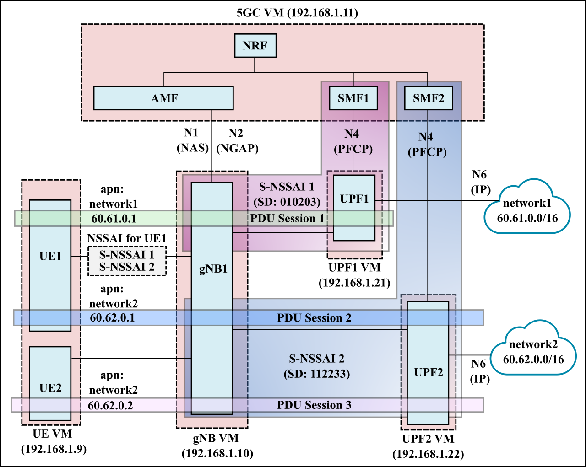
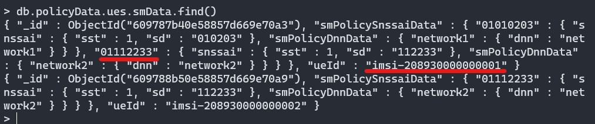
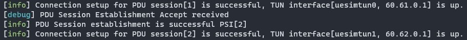
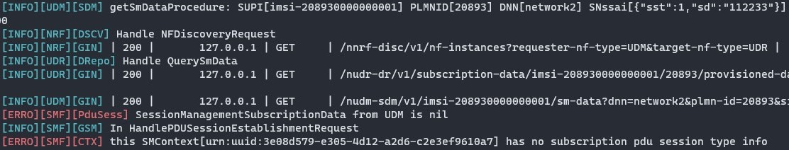

# Two network slices with UE connected to both slices

In this scenario, we have 2 S-NSSAI representing two network slices (each consisting of 1 SMF and 1 UPF). UE1 connects to multiple slices (both S-NSSAI 1 and S-NSSAI 2), while UE2 connects only to slice 2 (S-NSSAI 2).

**Table of Contents**
- [Setting up the VMs](#setting-up-the-vms)
- [Configuration](#configuration)
- [Running the NFs](#running-the-nfs)
- [Debugging](#debugging)
  

## Setting up the VMs
Exactly the same as two network slices. See instructions [here](../two-slices/README.md#setting-up-the-vms).

## Configuration
Mostly similar to two network slices. See instructions [here](../two-slices/README.md#configuraton). 

The key changes are the following:
- There are 3 PDU sessions instead of two. UE1 connects to PDU session 1 in slice 1 and PDU session 2 in slice 2. This requires changes to SMF configuration and UE configuration. The configuration files in the `config` directory have been modified to reflect these changes.

## Running the NFs

Mostly similar to two network slices. See instructions [here](../two-slices/README.md#running-the-nfs). 

**Important**: Remember to update UDM information for UE1 (i.e., include S-NSSAI 2 and DNN2) using the webconsole.

This can be verified using mondodb as shown below.

On successful run, you should see:

## Debugging

If UDM data regarding UE1 is not correctly updated, we can get the following error.

Verify that mongodb collection `db.policyData.ues.smData` has been updated correctly.

 

