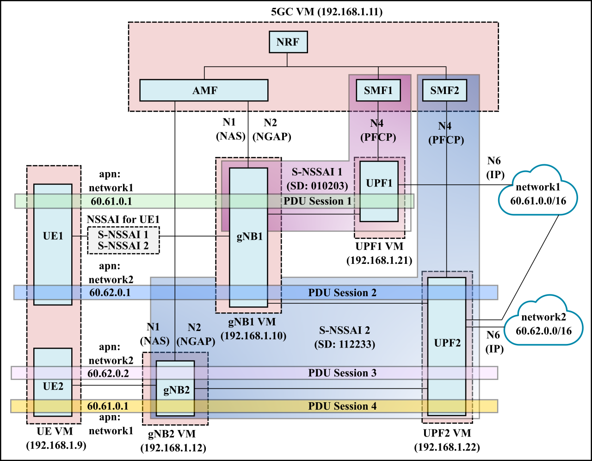

# Slicing 03: Multiple gNBs

- [Slicing 03: Multiple gNBs](#slicing-03-multiple-gnbs)
  - [Deployment scenario](#deployment-scenario)
  - [How to run](#how-to-run)
  - [VM placement](#vm-placement)
  - [Debugging](#debugging)
  

## Deployment scenario

- In this scenario, we have two slices (S-NSSAI 1 and S-NSSAI 2), each having 1 SMF and 1 UPF.
- We have 2 gNBs, and UE1 connects to gNB1 while UE2 connects to gNB2.
- UPF2 also connects to 2 DNNs (network1 and network2)

The configuration files for this deployment are in the [config](config) directory.

## How to run

See instructions [here](../slicing_02/README.md#how-to-run).

## VM placement

See information [here](../slicing_01/README.md#vm-placement).

One additional VM was created for gNB2 from gNB1 snapshot.

## Debugging

See debugging information [here](../slicing_02/README.md#debugging).

 

