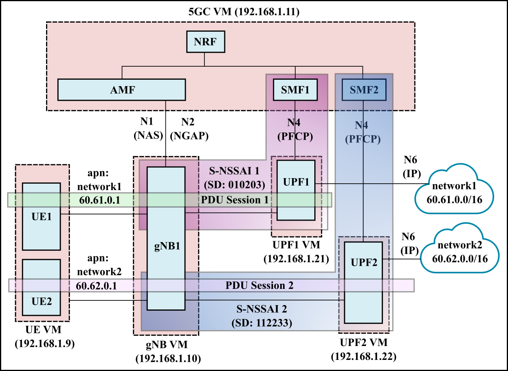
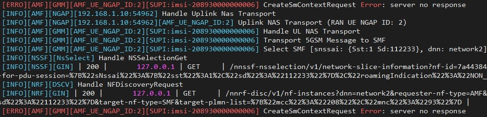

# Two network slices with an UE connnected to each slice

In this scenario, we have 2 S-NSSAI representing two network slices (each consisting of 1 SMF and 1 UPF). UE1 and UE2 each connect to separate slices with 1 PDU session each.



**Table of Contents**

- [Setting up the VMs](#setting-up-the-vms)
- [Configuration](#configuration)
- [Running the NFs](#running-the-nfs)
- [Debugging](#debugging)
  - [Using loopback addresses as PFCP interfaces](#using-loopback-addresses-as-pfcp-interfaces)
  - [SMF selection error](#smf-selection-error)
  - [Duplicate Mongodb entries](#duplicate-mongodb-entries)
  

## Setting up the VMs
We have 4 VMs and the deployment is exactly the same as single slice with multiple PDUs. See [instructions](../single-slice-multiple-pdu/README.md#setting-up-the-vms).

## Configuration
Mostly similar to single slice with multiple PDUs. See [instructions](./single-slice-multiple-pdu/README.md#configuration). This scenario introduces the following key changes:
- There are now 2 slice identifiers (i.e., S-NSSAI). Accordingly, these values must be properly set in the following places.
  - When [adding subscriber using the free5gc webconsole](https://www.youtube.com/watch?v=MWlMUejBPpA).
  - In the AMF, SMF, UPF, UE, and gNB configuration files. The configuration files in the `config` directory have been modified to reflect these changes.
- There are now two SMF binaries, `smf1` and `smf2`. These must be launched separately. Accordingly, the [run_5gc](scripts/run_5gc.sh) script has been modified to run two instances of the `smf` binary with the appropriate configuration file.

## Running the NFs

Same as single slice with multiple PDUs. See [instructions](./single-slice-multiple-pdu/README.md#running-the-nfs)

**Important**: Now that we have 2 SMFs on the same VM, which are using [loopback addesses](https://www.juniper.net/documentation/en_US/junos/topics/concept/interface-security-loopback-understanding.html), some configuration changes are necessary to enable correct routing of packets between them. See instructions for [using loopback addresses as PFCP interfaces](#using-loopback-addresses-as-pfcp-interfaces) before running.


## Debugging

### Using loopback addresses as PFCP interfaces 

To route packets from outside the local machine (i.e. PFCP packets from UPF1 or UPF2 VM) to the loopback addresses used as PFCP interfaces for SMF1 and SMF2, enable `route_localnet`.

```
sudo sysctl -w net.ipv4.conf.all.route_localnet=1
```
### SMF selection error

It is **very important** the SMF configuration files should only contain the S-NSSAIs which are supported by the UPF. For instance, if SMF1 only supports UPF1, and UPF1 only supports S-NSSAI 1, then **do not** put any other S-NSSAI in SMF1 configuration file!

Including any other S-NSSAI than those supported by the UPF can lead to AMF selecting the wrong SMF, leading to the following error.
  


This is due to the following.
- The SMF selection procedure only filters SMFs based on S-NSSAI and **does not look at UPF information**. This can be seen here [https://github.com/free5gc/amf/blob/6e0202ce2de6366856b005e5a5722745e420008f/consumer/sm_context.go#L90](https://github.com/free5gc/amf/blob/6e0202ce2de6366856b005e5a5722745e420008f/consumer/sm_context.go#L90).
- With reference to the deployment shown above, this means that including S-NSSAI 2 in SMF1 configuration leads to the AMF selecting SMF1 for PDU session 2, even though UPF1 does not support it. 

More details on the SMF selection process can be found [here](SMF-selection.md)

### Duplicate Mongodb entries

The mongodb entries are not cleared when free5gc is stopped.
This leads to the following issues.

- UE subscription information remaining in the database  
- Obsolete NF instances registered with the NRF remaining in the database. The relevant collections are `NfProfile` and `urilist`. Example `NfProfile` for SMF can be seen [here](logs/smf_nfprofile.json).

To address this issues, clear subscriber information and urilist using mongodb.
For how to use mongodb with free5gc, see instructions [here](../DEBUGGING.md#using-mongodb-database)

#### Clearing all subscriber information using Mongodb
 

All subscriber information can be removed using the following:
```
db.policyData.ues.amData.remove({})
db.policyData.ues.smData.remove({})
db.subscriptionData.authenticationData.authenticationStatus.remove({})
db.subscriptionData.authenticationData.authenticationSubscription.remove({})
db.subscriptionData.contextData.amf3gppAccess.remove({})
db.subscriptionData.provisionedData.amData.remove({})
db.subscriptionData.provisionedData.smData.remove({})
db.subscriptionData.provisionedData.smfSelectionSubscriptionData.remove({})
```

#### Clearing urilist collection when free5gc is stopped

- In the `urilist` collections, multiple instances of the same NF with different `NfInstanceId` exists in the database. Thus, there exists obsolete links to NF instances.
- Separate `NfInstanceId` exists for the same NF across different runs because in the init function, a random uuid string is generated everytime. See [https://github.com/free5gc/smf/blob/main/context/context.go#L21](https://github.com/free5gc/smf/blob/main/context/context.go#L21)
- A similar issue occurs with the `NfProfile` collection.
   
To clear, run the following from mongodb CLI.
```
db.NfProfile.remove({})
db.urilist.remove({})
```

**Note**: The script [run_5gc.sh](scripts/run_5gc.sh) includes the above two commands, so obsolete NF information is cleared when the core goes down.


