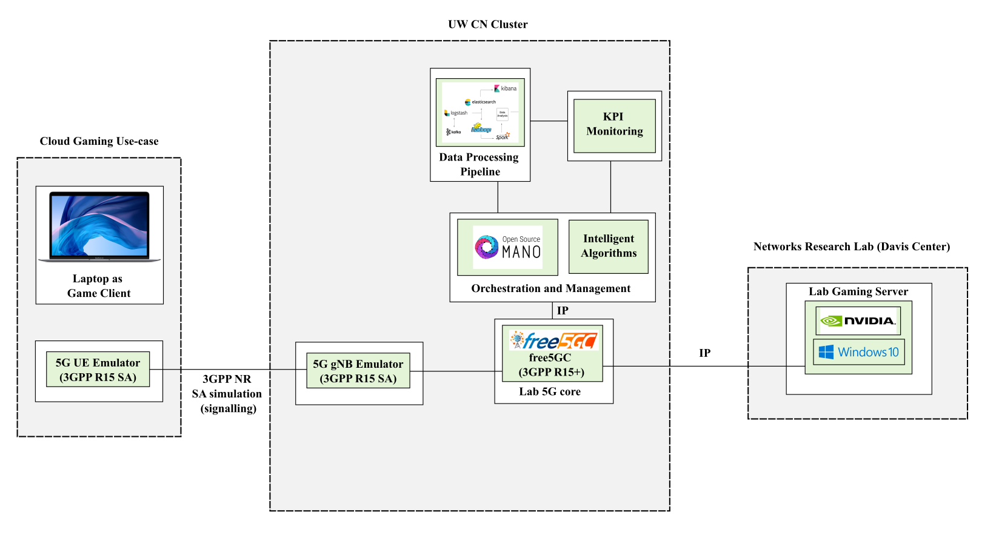
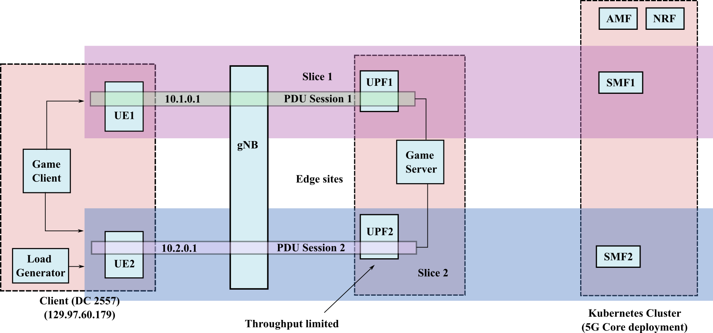

# Cloud Gaming Deployment
This directory contains configuration files and scripts used for deploying a cloud gaming use-case. This involves streaming a video game from a host PC to an UE through the 5G core deployment. This builds upon the `basic-slice-deployments`. The purpose of this deployment is to showcase the benefits of network slicing by having a network slice dedicated to the gaming stream.

The figure above shows the lab setup. The network slice deployment is shown in the figure below. This essentially builds on the [two slices scenario](../basic-slicing-deployments/two-slices/README.md)

.