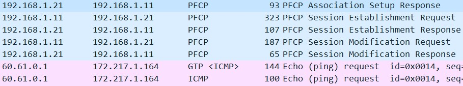

# Extract avg. throughput per slice

- [Extract avg. throughput per slice](#extract-avg-throughput-per-slice)
  - [Calculating avg. throughput per slice](#calculating-avg-throughput-per-slice)
  - [Calcutating GTP-U packets for a PDU session](#calcutating-gtp-u-packets-for-a-pdu-session)
    - [PFCP session establishment](#pfcp-session-establishment)
    - [Forwarding data between UP and CP](#forwarding-data-between-up-and-cp)
    - [Packet detection rule (PDR)](#packet-detection-rule-pdr)
  - [Calculating GTP-U packets for UL/DL per PDR](#calculating-gtp-u-packets-for-uldl-per-pdr)
  - [Tracing the free5GC UPF for GTP-U packet processing](#tracing-the-free5gc-upf-for-gtp-u-packet-processing)
    - [Build the UPF after changes to src](#build-the-upf-after-changes-to-src)
    - [Log debug messages](#log-debug-messages)
    - [Tracing](#tracing)
  - [Extracting GTP-U information from the kernel](#extracting-gtp-u-information-from-the-kernel)
  - [Tracing SMF NF to get PDRs for a PDU session](#tracing-smf-nf-to-get-pdrs-for-a-pdu-session)


## Calculating avg. throughput per slice

To calculate the average throughput per slice, we need to extract performance metrics from the UPF NF. Specifically, From 3GPP TS 28.552,  Sec 5.4.1.3, we need:

*Octets of GTP data packets on N3  interface, from RAN to UPF (GTP.InDataOctN3UPF.SNSSAI)*

A slice identifier, i.e., S-NSSAI may have one or more PDU sessions associated with it.
Thus, we need to calculate the number of GTP-U packets for a PDU session.

**Note**: The free5GC UPF implementation does not seem to differentiate between N3 and N9 interface, just handles them as GTP packets anyways. This means it is very difficult to get N3 or N9 specific measurements.

## Calcutating GTP-U packets for a PDU session


GTP traffic comes after PFCP Session Establishment and PFCP Session Modification.



The PFCP Association setup response (from UPF to SMF), before PDU establishment contains DNN.

### PFCP session establishment
- A PFCP session is uniquely identified by *fully-qualified SEID (F-SEID)* which contains both *session endpoint identifier (SEID)* and *IP address*. 
- From 3GPP TS 29.244 *Interface between the control and user plane nodes*:
> The PFCP session related messages shall share the same F-SEID for the PFCP session

### Forwarding data between UP and CP

From 3GPP TS 29.244 *Interface between the control and user plane nodes* (Section 5.3):

**From UP to CP**
> For forwarding data from the UP function to the CP function, the CP function shall provision PDR(s) per PFCP session context, with the PDI identifying the user plane traffic to forward to the CP function and with a FAR set with the Destination Interface "CP function side" and set to perform GTP-U encapsulation and to forward the packets to a GTP-u F-TEID uniquely assigned in the CP function per PFCP session and PDR.

**From CP to UP**
> For forwarding data from the CP function to the UP function, the CP function shall provision one or more PDR(s) per PFCP session context, with the PDI set with the Source Interface "CP function side" and identifying the GTP-u F-TEID uniquely assigned in the UP function per PDR, and with a FAR set to perform GTP-U decapsulation and to forward the packets to the intended destination.

- Fully qualified tunnel endpoint identifier (F-TEID)

### Packet detection rule (PDR)
From 3GPP TS 29.244 *Interface between the control and user plane nodes* (Section 5.3):

> On receipt of a user plane packet, the UP function shall perform a lookup of the provisioned PDRs and:
> - identify first the PFCP session to which the packet corresponds; and
> - find the first PDR matching the incoming packet, among all the PDRs provisioned for this PFCP session, starting
with the PDRs with the highest precedence and continuing then with PDRs in decreasing order of precedence.

> Only the highest precedence PDR matching the packet shall be selected, i.e. the UP function shall stop the PDRs lookup once a matching PDR is found.


A packet detection rule (PDR) has the following information.
- in port
- IP address
- DNN
- PDR ID: This IE shall uniquely identify the Packet Detection Rule among all the PDRs configured for that PFCP session.

A PDR is also associated with a PDI and FAR.
- PDI contains information such as IP address and port information and is used to detect specific packets.
- FAR i.e., forwarding action rule, states what to do with the packet, such as forward packet, create GTP-U/UDP/IPv4 encapsulation, etc.


## Calculating GTP-U packets for UL/DL per PDR


## Tracing the free5GC UPF for GTP-U packet processing

### Build the UPF after changes to src

```bash
cd ~/free5gc
make upf
```

### Log debug messages

Use the logging utililies in `lib/utlt/include/utlt_debug.c`
This may be used as:  
```bash
UTLT_Info("[NILOY] Test UPF log ...");
```

### Tracing

Look at `up/up_match.h` line 74.
```c
int PacketInWithGTPU(uint8_t *pkt, uint16_t pktlen, uint32_t remoteIP, uint16_t _remotePort, void *matchedPDR);
```

**Note**: In the free5GC code, a session seems to be identified by hash of IMSI + DNN.

## Extracting GTP-U information from the kernel


Tx and Rx bytes at the `upfgtp` interface.
```bash
cat /proc/net/dev
```

## Tracing SMF NF to get PDRs for a PDU session

- SEID for a UP node is allocated in [context/sm_context.go#L299](https://github.com/free5gc/smf/blob/3437241a3c03bbad1e88b47236fcd98b6f67333e/context/sm_context.go#L299)
- Activate uplink tunnel and put PDR to PFCP session in [context/datapath.go#L120](https://github.com/free5gc/smf/blob/3437241a3c03bbad1e88b47236fcd98b6f67333e/context/datapath.go#L120)


