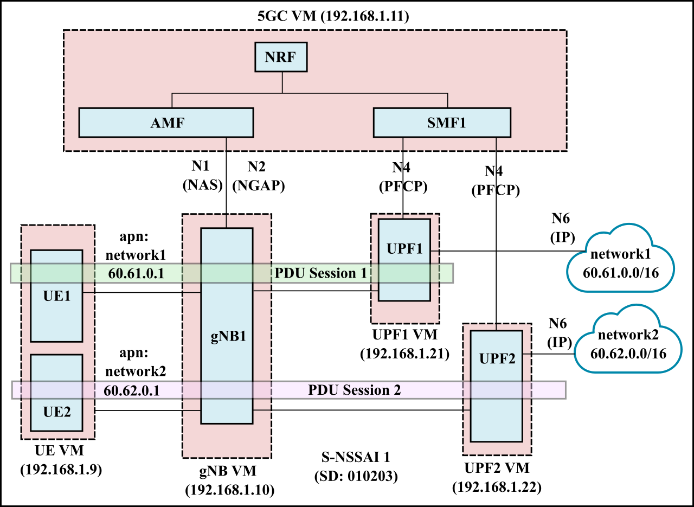
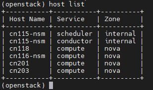
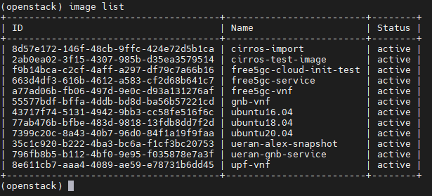
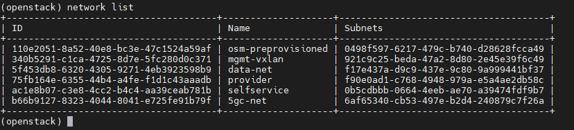

# 5GC setup with multiple UPF

- [5GC setup with multiple UPF](#5gc-setup-with-multiple-upf)
  - [Deployment scenario](#deployment-scenario)
  - [VM placement](#vm-placement)
    - [create UE on 5gc-net on cn116-nsm](#create-ue-on-5gc-net-on-cn116-nsm)
    - [create gnB on 5gc-net on cn118](#create-gnb-on-5gc-net-on-cn118)
    - [create 5GC on 5gc-net on cn116-nsm](#create-5gc-on-5gc-net-on-cn116-nsm)
    - [create UPFb on cn201](#create-upfb-on-cn201)
    - [create UPF1 on cn201](#create-upf1-on-cn201)
    - [create UPF2 on cn203](#create-upf2-on-cn203)

## Deployment scenario



The configuration files for this deployment are in the `multi_upf/config` folder.

## VM placement
The hosts are as follows:  


The NFs are placed as follows:
-	gNodeB on 118
-	UE on 116
-	UPFb and UPF1 on 201
-	UPF2 on 203
-	5GC on 116

This is to ensure that the userplane of two NFs does not share the same PHY host when doing bandwidth tests.

### create UE on 5gc-net on cn116-nsm
- Get the image id  


We use the `gnb-vnf` image since it contains the UERANSIM project which also implements the UE.
The username is `ubuntu` and the password is `osm4u`.

- Get the network id for 5gc-net  


The network id of 5gc-net is `b66b9127-8323-4044-8041-e725fe91b79f`

- Create the VM
```
server create --image gnb-vnf --flavor m1.medium --security-group ns-secgroup --availability-zone nova::cn116-nsm  --nic net-id=b66b9127-8323-4044-8041-e725fe91b79f,v4-fixed-ip=192.168.1.9 ue
```

- Create and allocate floating ip
```
floating ip create provider
floating ip list
server add floating ip ue 10.10.0.208
```

### create gnB on 5gc-net on cn118
We use the `gnb-vnf` image since it contains the UERANSIM project which implements the gNB.
The username is `ubuntu` and the password is `osm4u`.

- Create the VM
```
server create --image gnb-vnf --flavor m1.medium --security-group ns-secgroup --availability-zone nova::cn118  --nic net-id=b66b9127-8323-4044-8041-e725fe91b79f,v4-fixed-ip=192.168.1.10 gnb
```

- Create and allocate floating ip
```
floating ip create provider
floating ip list
server add floating ip gnb 10.10.0.202
```

### create 5GC on 5gc-net on cn116-nsm
We use the `free5gc-vnf` image since it contains the UERANSIM project which implements the gNB.
The username is `ubuntu` and the password is `osm4u`.

- Create the VM
```
server create --image free5gc-vnf --flavor m1.medium --security-group ns-secgroup --availability-zone nova::cn116-nsm  --nic net-id=b66b9127-8323-4044-8041-e725fe91b79f,v4-fixed-ip=192.168.1.11 5gc
```
Use same process as above to add floating ip.

### create UPFb on cn201
- Create the VM
```
server create --image upf-vnf --flavor m1.medium --security-group ns-secgroup --availability-zone nova::cn201  --nic net-id=b66b9127-8323-4044-8041-e725fe91b79f,v4-fixed-ip=192.168.1.20 upfb
```

### create UPF1 on cn201
- Create the VM
```
server create --image upf-vnf --flavor m1.medium --security-group ns-secgroup --availability-zone nova::cn201  --nic net-id=b66b9127-8323-4044-8041-e725fe91b79f,v4-fixed-ip=192.168.1.21 upf1
```

### create UPF2 on cn203
- Create the VM
```
server create --image upf-vnf --flavor m1.medium --security-group ns-secgroup --availability-zone nova::cn203  --nic net-id=b66b9127-8323-4044-8041-e725fe91b79f,v4-fixed-ip=192.168.1.22 upf2
```