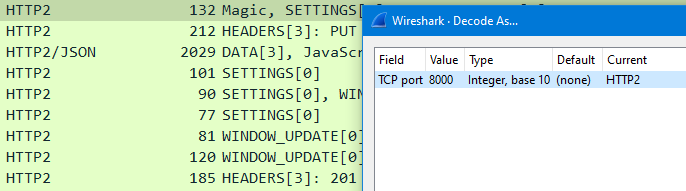

# Packet captures for 5GC

- [Packet captures for 5GC](#packet-captures-for-5gc)
  - [At the UPF](#at-the-upf)
  - [At UE (filter out SSH traffic)](#at-ue-filter-out-ssh-traffic)
  - [Decode HTTP2 packets at the SBI for 5G NFs](#decode-http2-packets-at-the-sbi-for-5g-nfs)
  - [Capture messages between UE and gNB](#capture-messages-between-ue-and-gnb)

## At the UPF
`sudo tcpdump -i upfgtp -v -w upf.pcap`

The `-v` flag shows the count for the number of packets captured.

## At UE (filter out SSH traffic)
`sudo tcpdump -i ens3 -v -w ue_ens3.pcap port not 22`

## Decode HTTP2 packets at the SBI for 5G NFs
- Messages are in HTTP2 format
- Require TCP rules to decode. Go to analyze -> decode as -> add tcp rule with port 8000 (NRF binding port) and decode as http2

## Capture messages between UE and gNB
todo