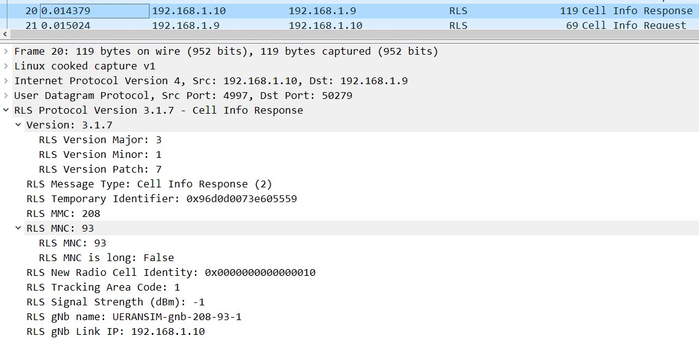

# Packet captures for 5GC

- [Packet captures for 5GC](#packet-captures-for-5gc)
  - [Using tcpdump to capture packets](#using-tcpdump-to-capture-packets)
  - [Decoding UERANSIM RLS packets](#decoding-ueransim-rls-packets)
  - [Decode HTTP2 packets at the SBI for 5G NFs](#decode-http2-packets-at-the-sbi-for-5g-nfs)

## Using tcpdump to capture packets

Capture packets at a particular interface by specifying the `-i` flag as follows:  
`sudo tcpdump -i upfgtp -v -w upf.pcap`

The `-v` flag shows the count for the number of packets captured.

Filter out SSH traffic by specifying port 22  
`sudo tcpdump -i ens3 -v -w ue_ens3.pcap port not 22`

## Decoding UERANSIM RLS packets
- UERANSIM uses a custom radio link simulation (RLS) protocol between the UE and the gNB.
- These can be decoded by installing a wireshark plugin from [https://github.com/louisroyer/RLS-wireshark-dissector.git](https://github.com/louisroyer/RLS-wireshark-dissector.git)

## Decode HTTP2 packets at the SBI for 5G NFs
- Messages are in HTTP2 format
- Require TCP rules to decode. Go to analyze -> decode as -> add tcp rule with port 8000 (NRF binding port) and decode as http2

