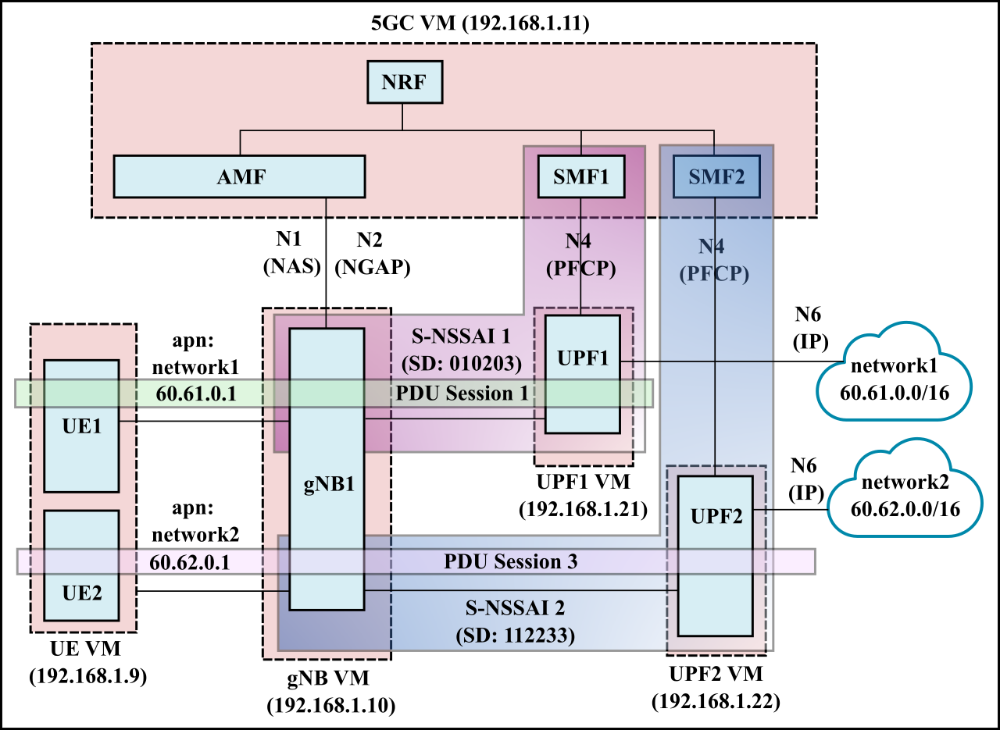
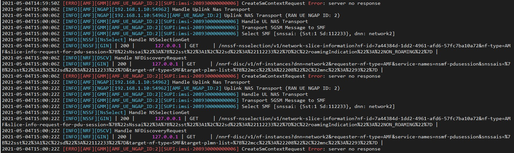

# 5GC Setup: Slicing 01 (WIP)

This is WIP. See [Issues](#issues).

- [5GC Setup: Slicing 01 (WIP)](#5gc-setup-slicing-01-wip)
  - [Deployment scenario](#deployment-scenario)
  - [VM placement](#vm-placement)
  - [Issues](#issues)
  - [Debugging](#debugging)
    - [Clearing all subscriber information using Mongodb](#clearing-all-subscriber-information-using-mongodb)

## Deployment scenario

- In this scenario, we have 2 S-NSSAI representing two network slices (each consisting of 1 SMF and 1 UPF). 
- UE1 and UE2 each connect to separate slices with 1 PDU session each.



The configuration files for this deployment are in the [config](config) directory.

## VM placement

The VM placement is the same as the [multi_upf](../multi_upf) scenario. Please see the [README](../multi_upf/README.md) there.

## Issues
- Two SMFs are not working together. The second SMF instance does not respond to the AMF and gives the following error during PDU establishment.
  


## Debugging

### Clearing all subscriber information using Mongodb
Run the mongodb CLI and switch to free5gc database.  
```
$ use free5gc
```
See a list of all collections using `show collections`  

Remove all subscription information
```
db.NfProfile.remove({})
db.policyData.ues.amData.remove({})
db.policyData.ues.smData.remove({})
db.subscriptionData.authenticationData.authenticationStatus.remove({})
db.subscriptionData.authenticationData.authenticationSubscription.remove({})
db.subscriptionData.contextData.amf3gppAccess.remove({})
db.subscriptionData.provisionedData.amData.remove({})
db.subscriptionData.provisionedData.smData.remove({})
db.subscriptionData.provisionedData.smfSelectionSubscriptionData.remove({})
```
