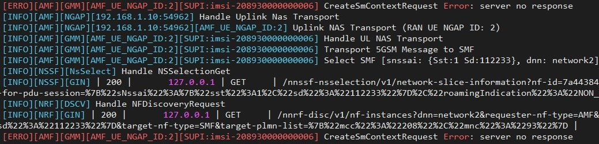

# 5GC Setup: Slicing 01

- [5GC Setup: Slicing 01](#5gc-setup-slicing-01)
  - [Deployment scenario](#deployment-scenario)
  - [How to run](#how-to-run)
  - [VM placement](#vm-placement)
  - [Debugging](#debugging)
    - [Using loopback addresses as PFCP interfaces](#using-loopback-addresses-as-pfcp-interfaces)
    - [SMF selection error](#smf-selection-error)
    - [Duplicate Mongodb entries](#duplicate-mongodb-entries)
      - [Using Mongodb database](#using-mongodb-database)
      - [Clearing all subscriber information using Mongodb](#clearing-all-subscriber-information-using-mongodb)
      - [Clearing urilist collection when free5gc is stopped](#clearing-urilist-collection-when-free5gc-is-stopped)
  - [Enhancements](#enhancements)
    - [SMF filtering and selection](#smf-filtering-and-selection)
  

## Deployment scenario

- In this scenario, we have 2 S-NSSAI representing two network slices (each consisting of 1 SMF and 1 UPF). 
- UE1 and UE2 each connect to separate slices with 1 PDU session each.


The configuration files for this deployment are in the [config](config) directory.

## How to run

The [scripts](scripts) directory contains various scripts for running the setup. Obviously, each script should be run from the proper VM, i.e. UPF1 script should be run from the UPF1 VM.
- [run_5gc](scripts/run_5gc.sh): Run the free5gc core.
- [run_upf](scripts/run_upf.sh): Run the UPF functions. Run with positional arguments as `./run_upf 1` to run UPF1 and similarly for UPF2. The positional arguments are used to select the proper configuration file.
- [run_gnb](scripts/run_gnb.sh): Run the UERANSIM gNB
- [launch_ue](scripts/launch_ue.sh): Run the UE. Run with positional arguments as `./launch_ue.sh 1` to run UE1 and similarly for UE2.

**IMPORTANT**: See instructions for [using loopback addresses as PFCP interfaces](#using-loopback-addresses-as-pfcp-interfaces) before running.


## VM placement

The VM placement is the same as the [multi_upf](../multi_upf) scenario. Please see the [README](../multi_upf/README.md) there.


## Debugging

### Using loopback addresses as PFCP interfaces 

To route packets from outside the local machine (i.e. PFCP packets from UPF1 or UPF2 VM) to the loopback addresses used as PFCP interfaces for SMF1 and SMF2, enable `route_localnet`.

```
sudo sysctl -w net.ipv4.conf.all.route_localnet=1
```
### SMF selection error

It is **very important** the SMF configuration files should only contain the S-NSSAIs which are supported by the UPF. For instance, if SMF1 only supports UPF1, and UPF1 only supports S-NSSAI 1, then **do not** put any other S-NSSAI in SMF1 configuration file!

Including any other S-NSSAI than those supported by the UPF can lead to AMF selecting the wrong SMF, leading to the following error.
  


This is due to the following.
- The SMF selection procedure only filters SMFs based on S-NSSAI and **does not look at UPF information**. This can be seen here [https://github.com/free5gc/amf/blob/6e0202ce2de6366856b005e5a5722745e420008f/consumer/sm_context.go#L90](https://github.com/free5gc/amf/blob/6e0202ce2de6366856b005e5a5722745e420008f/consumer/sm_context.go#L90).
- With reference to the deployment shown above, this means that including S-NSSAI 2 in SMF1 configuration leads to the AMF selecting SMF1 for PDU session 2, even though UPF1 does not support it. 


  


### Duplicate Mongodb entries

The mongodb entries are not cleared when free5gc is stopped.
This leads to the following issues.

- UE subscription information remaining in the database  
- Obsolete NF instances registered with the NRF remaining in the database. The relevant collections are `NfProfile` and `urilist`. Example `NfProfile` for SMF can be seen [here](logs/smf_nfprofile.json).


#### Using Mongodb database
Run the mongodb CLI and switch to free5gc database using `use free5gc`.  
See a list of all collections using `show collections` .

Information can be extracted from mongodb in JSON format as follows:
```
mongo free5gc --eval "printjson(db.NfProfile.findOne({nfType: 'SMF'}))" > smf_nfprofile.json
```

#### Clearing all subscriber information using Mongodb
 

All subscriber information can be removed using the following:
```
db.policyData.ues.amData.remove({})
db.policyData.ues.smData.remove({})
db.subscriptionData.authenticationData.authenticationStatus.remove({})
db.subscriptionData.authenticationData.authenticationSubscription.remove({})
db.subscriptionData.contextData.amf3gppAccess.remove({})
db.subscriptionData.provisionedData.amData.remove({})
db.subscriptionData.provisionedData.smData.remove({})
db.subscriptionData.provisionedData.smfSelectionSubscriptionData.remove({})
```

#### Clearing urilist collection when free5gc is stopped

- In the `urilist` collections, multiple instances of the same NF with different `NfInstanceId` exists in the database. Thus, there exists obsolete links to NF instances.
- Separate `NfInstanceId` exists for the same NF across different runs because in the init function, a random uuid string is generated everytime. See [https://github.com/free5gc/smf/blob/main/context/context.go#L21](https://github.com/free5gc/smf/blob/main/context/context.go#L21)
- A similar issue occurs with the `NfProfile` collection.
   
To clear, run the following from mongodb CLI.
```
db.NfProfile.remove({})
db.urilist.remove({})
```

**Note**: The updated script [run_5gc.sh](scripts/run_5gc.sh) includes the above two commands, so obsolete NF information is cleared when the core goes down.


## Enhancements

### SMF filtering and selection
- The available SMFs are filtered by S-NSSAI only. The relevant code is [https://github.com/free5gc/nrf/blob/386a6bdda516b64da43dd1711e3893528deaf0b9/producer/nf_discovery.go#L287](https://github.com/free5gc/nrf/blob/386a6bdda516b64da43dd1711e3893528deaf0b9/producer/nf_discovery.go#L287). This can be verified by running the following query in mongodb. 

  ```
  db.NfProfile.find({
      $and: [
          {
              "nfType": "SMF"
          },
          {
              "smfInfo.sNssaiSmfInfoList": { $elemMatch: {
                      "sNssai.sd": "112233"
                  }
              }
          },
      ],
  },
  {
      "ipv4Addresses": 1
  })
  ```

- The parameters used for filtering SMF are S-NSSAI and DNN. This can be seen here.
  ```go
  {ServiceNames:{isSet:true value:[nsmf-pdusession]} RequesterNfInstanceFqdn:{isSet:false value:} TargetPlmnList:{isSet:true value:[{"mcc":"208","mnc":"93"}]} RequesterPlmnList:{isSet:false value:<nil>} TargetNfInstanceId:{isSet:false value:<nil>} TargetNfFqdn:{isSet:false value:} HnrfUri:{isSet:false value:} Snssais:{isSet:true value:[{"sst":1,"sd":"112233"}]} Dnn:{isSet:true value:network2} NsiList:{isSet:false value:<nil>} SmfServingArea:{isSet:false value:} Tai:{isSet:false value:<nil>} AmfRegionId:{isSet:false value:} AmfSetId:{isSet:false value:} Guami:{isSet:false value:<nil>} Supi:{isSet:false value:} UeIpv4Address:{isSet:false value:} IpDomain:{isSet:false value:} UeIpv6Prefix:{isSet:false value:<nil>} PgwInd:{isSet:false value:false} Pgw:{isSet:false value:} Gpsi:{isSet:false value:} ExternalGroupIdentity:{isSet:false value:} DataSet:{isSet:false value:<nil>} RoutingIndicator:{isSet:false value:} GroupIdList:{isSet:false value:<nil>} DnaiList:{isSet:false value:<nil>} SupportedFeatures:{isSet:false value:} UpfIwkEpsInd:{isSet:false value:false} ChfSupportedPlmn:{isSet:false value:<nil>} PreferredLocality:{isSet:false value:} AccessType:{isSet:false value:<nil>} IfNoneMatch:{isSet:false value:}}
  ```
- If more than one SMF is available for a given S-NSSAI, the first instance is chosen. The current implementation does not support any other selection criteria. The relevant code is [https://github.com/free5gc/amf/blob/6e0202ce2de6366856b005e5a5722745e420008f/consumer/sm_context.go#L100](https://github.com/free5gc/amf/blob/6e0202ce2de6366856b005e5a5722745e420008f/consumer/sm_context.go#L100).
  
- The following shows the result of filtering SMF by S-NSSAI. Very little information is included which can be used for SMF selection.

  ```go
  {ValidityPeriod:100 NfInstances:[{NfInstanceId:d86056f0-da2d-4901-88b6-18263f1163f4 NfType:SMF NfStatus:REGISTERED HeartBeatTimer:0 PlmnList:0xc0004f6048 SNssais:0xc0004f6078 PerPlmnSnssaiList:[] NsiList:[] Fqdn: InterPlmnFqdn: Ipv4Addresses:[127.0.0.62] Ipv6Addresses:[] AllowedPlmns:<nil> AllowedNfTypes:[] AllowedNfDomains:[] AllowedNssais:<nil> Priority:0 Capacity:0 Load:0 Locality: UdrInfo:<nil> UdmInfo:<nil> AusfInfo:<nil> AmfInfo:<nil> SmfInfo:0xc0000ae680 UpfInfo:<nil> PcfInfo:<nil> BsfInfo:<nil> ChfInfo:<nil> NrfInfo:<nil> CustomInfo:map[] RecoveryTime:<nil> NfServicePersistence:false NfServices:0xc0004f6138 NfProfileChangesSupportInd:false NfProfileChangesInd:false DefaultNotificationSubscriptions:[]}] NrfSupportedFeatures:}
  ```
- SMF selection criteria are given in 3GPP TS 23.501 Section 6.3.2.


 

