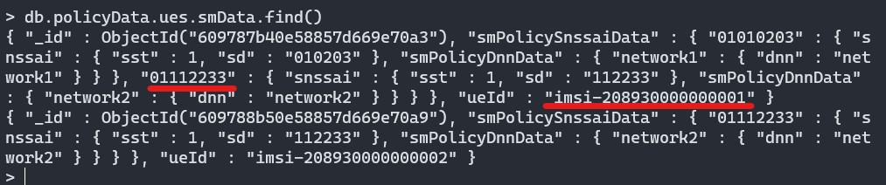
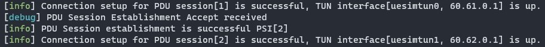
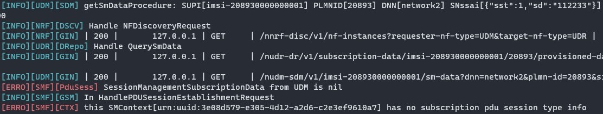

# 5GC Setup: Slicing 02

- [5GC Setup: Slicing 02](#5gc-setup-slicing-02)
  - [Deployment scenario](#deployment-scenario)
  - [How to run](#how-to-run)
  - [VM placement](#vm-placement)
  - [Debugging](#debugging)
  

## Deployment scenario

- In this scenario, we have 2 S-NSSAI representing two network slices (each consisting of 1 SMF and 1 UPF). 
- UE1 connects to multiple slices (both S-NSSAI 1 and S-NSSAI 2), while UE2 connects only to slice 2 (S-NSSAI 2).

The configuration files for this deployment are in the [config](config) directory.

## How to run

See instructions [here](../slicing_01/README.md#how-to-run).

**Important!**: Remember to update UDM information for UE1 (i.e., include S-NSSAI 2 and DNN2) using the webconsole.

Check using mondodb as shown below.

On successful run, you should see:

## VM placement

See information [here](../slicing_01/README.md#vm-placement).

## Debugging

See debugging information [here](../slicing_01/README.md#debugging).

If UDM data regarding UE1 is not correctly updated, we can get the following error.

Verify that mongodb collection `db.policyData.ues.smData` has been updated correctly.

 

